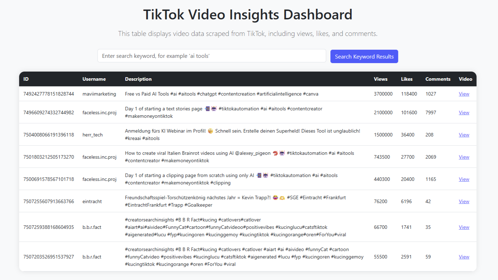

# TikTok Insider

A Flask web app that fetches TikTok video data based on user search keywords using Apify, stores it in a MySQL database, and displays it in a searchable dashboard.




## Features

- Search TikTok videos by keyword
- Fetch latest data using Apify actor
- Store video data (views, likes, comments, etc.) in MySQL
- Display results in a clean Bootstrap table
- Avoid duplicate entries with upsert logic

## Tech Stack

- Python, Flask
- MySQL
- Apify (for TikTok scraping)
- Bootstrap 5

## Setup

1. Clone the repo  
   ```bash
   git clone https://github.com/yourusername/tiktok-insider.git
   cd tiktok-insider

2. Create and activate a Python virtual environment
  python -m venv venv
  source venv/bin/activate  # Linux/macOS
  venv\Scripts\activate     # Windows

3. Install dependencies
  pip install -r requirements.txt

4. Set up MySQL database
  Create a database called social_data
  
  Create a tiktoks table with columns:
    id (PRIMARY KEY), username, description, views, likes, comments, video_url

5. Update your MySQL credentials in app.py

6. Run the Flask app
   flask run

7. Open http://localhost:5000 in your browser

## Usage

Enter a keyword in the search bar

Click "Fetch Latest TikTok Data"

The app will fetch, store, and display the latest TikTok videos related to the keyword

## Deployment

Use platforms like Railway, Render, or Heroku to deploy
Set environment variables for your MySQL credentials and Flask secret key

## Notes

Requires an Apify actor token and setup (see apify_fetch.py)
Handles duplicate video entries using ON DUPLICATE KEY UPDATE in SQL

## Licence

MIT Licence
